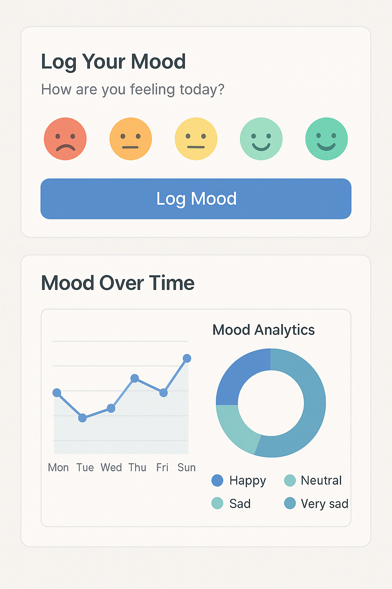
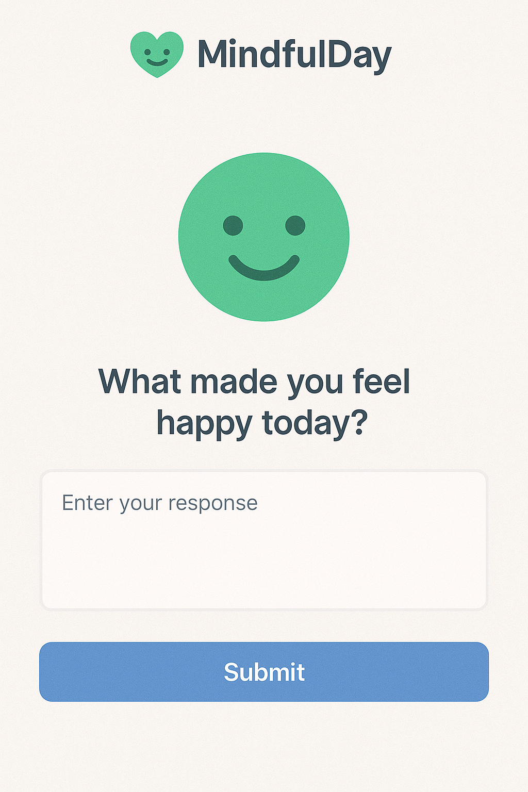
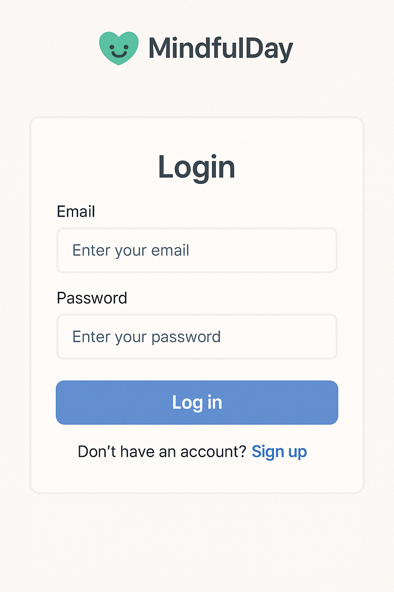
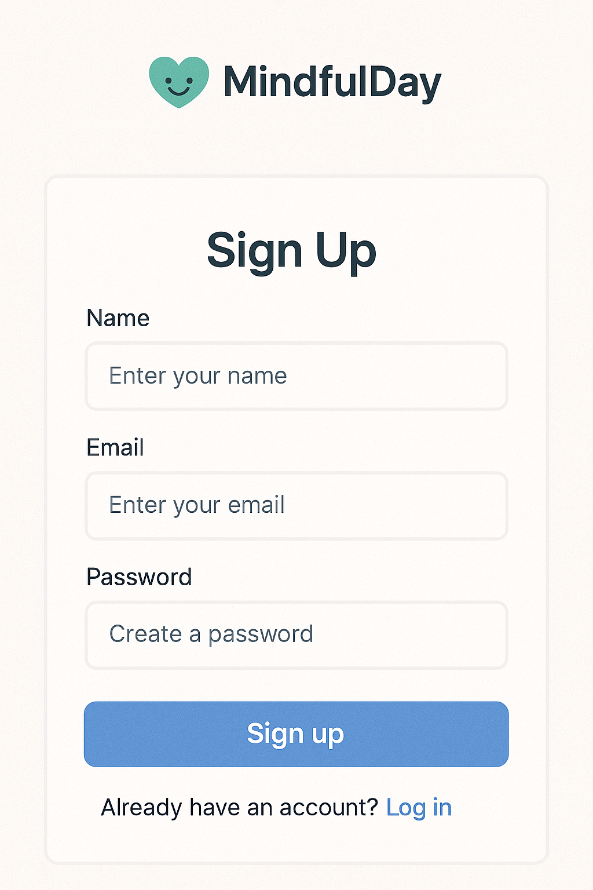

# 218239-AG-AISOFTDEV-Team-4

# 💚 MindfulDay

**MindfulDay** is a full-stack mental wellness journaling application that helps users track their moods and reflect through daily prompts. It offers a simple, secure, and thoughtful experience for users to log how they're feeling, write reflective journal entries, and view recent trends — all wrapped in a clean, user-friendly UI.

---

## 🚀 Features

- 📆 Mood logging with emoji-based interface
- ✍️ Prompt-based journal entries
- 🧠 Optional AI-generated reflections (ephemeral)
- 📊 View recent journal history
- 🔐 JWT-based login and authentication
- 🎨 Clean Tailwind UI with calming gradients

---

## 🧑‍💻 Tech Stack

**Frontend:**  
- React  
- React Router  
- Tailwind CSS  

**Backend:**  
- FastAPI  
- SQLite  
- SQLAlchemy  
- Bcrypt & JWT for authentication  

---

## 📸 Screenshots

| Main Page | Mood Logger + Chart |
|-----------|---------------------|
|  |  |

| Login | Sign Up |
|-------|---------|
|  |  |

---

## 🧪 Demo User

You can use the following account for demo purposes:

```

Email: [demo1@example.com](mailto:demo1@example.com)
Password: demo123

````

This account includes a preloaded history of moods and journal entries for demonstration.

---

## 🛠️ Local Setup

1. **Clone the repo**  
   ```bash
   git clone https://github.com/your-username/mindfulday.git
   cd mindfulday
````

2. **Install backend dependencies**

   ```bash
   pip install -r requirements.txt
   ```

3. **Install frontend dependencies**

   ```bash
   cd frontend
   npm install
   ```

4. **Initialize the database**
   You can use the provided script and SQL files to create and seed the database:

   ```bash
   python seed_db.py
   ```

5. **Run the app**

   * Backend: `uvicorn app.main:app --reload`
   * Frontend: `npm run dev`

---

## 📂 Project Structure

```
.
├── app/                # FastAPI backend
│   ├── main.py
│   └── models.py
├── frontend/           # React frontend
│   ├── App.js
│   └── components/
├── schema.sql          # DB schema
├── seed_data.sql       # Demo data
├── seed_db.py          # Script to build + seed DB
└── README.md
```

---

## 🤖 AI Integration

While not required to use the app, MindfulDay includes optional ephemeral AI-generated journal reflections. These suggestions are intended to help users reflect more deeply and are not stored or used for analysis.

---

## 📌 Future Improvements

* Persistent AI feedback storage
* Mood trends analytics dashboard
* Dark mode support
* Mobile-first responsive layout
* OAuth login (Google or GitHub)

---

## 📃 License

MIT License © 2025

---

## 🙏 Acknowledgements

This app was built as part of a capstone project to explore the intersection of mental health and technology, and to practice full-stack development with modern tools. Special thanks to the instructor and peers for feedback and support!
